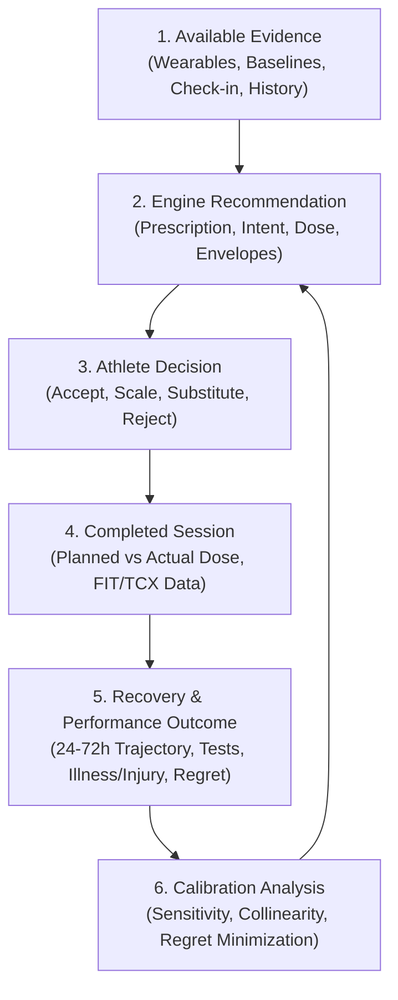

# Scientific and Recommendation-Quality Validation — Closing the Adaptive Decision Loop

**Date:** 2026-08-26
**Status:** point-in-time analysis
**Scope:** evaluate the physiological and mathematical validity of each recommendation signal, assess baseline window sensitivity, diagnose collinear multi-counting, and design the closed feedback loop connecting recommendation, athlete agency, execution dose, multi-day recovery, standardized performance, and calibration analysis.

---

## Executive Summary & Verdict

The adaptive training recommender has reached a high level of structural maturity: it possesses strict user-isolated Firestore persistence, deterministic sequence planning, explicit weekly role reservations (ADR-0018), source-neutral authored sessions (ADR-0023), protocol-locked performance observation models (OV), and fail-closed physiological anomaly evaluation (ADR-0025).

However, current evaluation mechanisms rely heavily on **synthetic scenario harnesses**, **in-vitro replay audits**, and **agreement with offline LLM judges**.

```text
Agreement with an AI judge != Biological validity
Biological validity != Real-world athlete usefulness
Athlete usefulness == High adherence + Verified adaptation + Minimal injury/illness downtime + Zero regret
```

Optimizing purely for agreement with an LLM judge measures prompt conformity and common coaching priors, not empirical physiological truth. Ground truth lies in **prospective real-world outcomes**.

To achieve genuine scientific and recommendation-quality validation, the system requires:
1. **Signal Fidelity & Marginal Information Auditing:** Determining whether each input signal (HRV, RHR, Sleep, Respiration, Training Load, Soreness, Energy) provides independent explanatory value or redundant noise.
2. **Temporal Window Calibration:** Testing 7d rolling acute context versus 28d chronic reference baselines to optimize signal-to-noise ratio.
3. **Collinearity & Multi-Counting Diagnostics:** Ensuring cascading stress indicators do not over-penalize the athlete.
4. **The Closed Feedback Loop:** Instrumenting the complete operational cycle from daily recommendation through athlete decision, completed dose, 24-72h recovery trajectory, standardized performance testing, and counterfactual regret analysis.

---

## 1. Signal-by-Signal Information Contribution & Physiological Validity

Each wearable and subjective signal captured by the system must have a clearly articulated physiological role, known noise profile, and defined failure modes.

```text
+----------------------+--------------------------+-------------------------+------------------------------------+
| Signal               | Physiological Dimension  | Noise / Artifact Risk   | Collinearity & Guardrail           |
+----------------------+--------------------------+-------------------------+------------------------------------+
| Overnight HRV        | Parasympathetic cardiac  | High (sleep posture,    | High overlap with RHR & sleep;     |
| (rMSSD, ln(rMSSD))   | modulation (ANS state)   | late meal, alcohol)     | must use log-transform & baseline. |
+----------------------+--------------------------+-------------------------+------------------------------------+
| Resting Heart Rate   | Basal metabolic &        | Moderate (hydration,    | Inversely related to HRV; strong   |
| (Nightly RHR)        | autonomic arousal        | ambient temperature)    | illness marker when discordant.    |
+----------------------+--------------------------+-------------------------+------------------------------------+
| Sleep Score /        | Neuroendocrine & CNS     | High (wearable stage    | Wearable sleep score embeds HRV;   |
| Duration & Stages    | restoration              | classification error)   | evaluate duration + score distinct.|
+----------------------+--------------------------+-------------------------+------------------------------------+
| Nocturnal            | Respiratory homeostasis  | Low                     | Highly orthogonal to cardiac data; |
| Respiration Rate     | & systemic immune state  |                         | prime early-warning for infection. |
+----------------------+--------------------------+-------------------------+------------------------------------+
| Training Load        | External mechanical &    | Moderate (GPS/power     | Ambient step deductions prevent    |
| (Work / Volume / TE) | internal metabolic dose  | device drift)           | double-counting structured load.   |
+----------------------+--------------------------+-------------------------+------------------------------------+
| Subjective Soreness  | Local peripheral tissue  | Subjective anchoring    | Essential tissue-gate; catches     |
| & Joint Status       | integrity / damage       | & rating fatigue        | structural strain missed by HRV.   |
+----------------------+--------------------------+-------------------------+------------------------------------+
| Subjective Readiness | Central systemic &       | Psychological / mood    | Self-normalizing drift (ADR-0020)  |
| & Mental Energy      | psychological capacity   | confounders             | prevents chronic anchor drift.     |
+----------------------+--------------------------+-------------------------+------------------------------------+
```

### 1.1 Overnight HRV (`rMSSD` / ln(rMSSD))
* **Physiological Basis:** Root mean square of successive differences (`rMSSD`) reflects vagal parasympathetic modulation of cardiac cycle intervals.
* **Literature Reality:** Raw single-night HRV exhibits a typical within-individual coefficient of variation of 10-15%. An un-smoothed, single-day dip often reflects acute non-training stressors (e.g., late dinner, ambient heat) rather than systemic overreaching.
* **Audit Requirement:** Validate that decisions rely on ln(rMSSD) evaluated against a 28d rolling baseline band rather than raw absolute thresholds. Measure if HRV suppression correlates with decreased submaximal aerobic efficiency (HR:Power decoupling) in subsequent workouts.

### 1.2 Resting Heart Rate (RHR)
* **Physiological Basis:** Basal nocturnal heart rate reflects metabolic rate, sympathetic tone, and plasma volume dynamics.
* **Literature Reality:** An acute elevation of >+1.5σ (>3-5 bpm) is a sensitive, though non-specific, indicator of systemic stress, delayed parasympathetic reactivation, or pathogen defense.
* **Audit Requirement:** Quantify the diagnostic value of **HRV-RHR discordance** (e.g. low HRV with normal RHR vs. low HRV with elevated RHR). Elevated RHR with low HRV represents strong systemic load; isolated low HRV often represents transient vagal suppression.

### 1.3 Nocturnal Respiration Rate
* **Physiological Basis:** Central respiratory drive during non-REM sleep is tightly regulated by brainstem chemoreceptors and inflammatory cytokines.
* **Literature Reality:** Respiration rate is exceptionally stable in healthy athletes (CV < 3%). Elevations of +1.0-1.5 brpm (>2σ) frequently precede self-reported fever and upper respiratory tract symptoms by 24-48 hours.
* **Audit Requirement:** Keep respiration rate orthogonal to routine daily readiness scaling; preserve it as a primary trigger in the **physiological anomaly evaluator** (`healthAnomaly.ts` / ADR-0025).

### 1.4 Sleep Architecture & Duration
* **Physiological Basis:** Total sleep duration, slow-wave sleep (SWS), and REM sleep support muscular glycogen replenishment, growth hormone secretion, and cognitive recovery.
* **Literature Reality:** Consumer wearable sleep stage algorithms have moderate accuracy for deep/REM phases. However, total sleep duration and sleep efficiency are robust.
* **Audit Requirement:** Test whether a composite sleep score adds marginal predictive power over raw total sleep duration plus subjective sleep quality.

### 1.5 Subjective Tissue & Systemic Check-Ins
* **Physiological Basis:** Athlete self-report measures of muscle soreness, joint tenderness, mental energy, and readiness capture musculoskeletal damage and central fatigue that autonomic sensors (wrist photoplethysmography) cannot detect.
* **Literature Reality:** Multiple sports-science systematic reviews indicate subjective measures respond to acute and chronic training load changes with higher consistency and lower latency than objective resting cardiac metrics.
* **Audit Requirement:** Verify that subjective tissue ratings act as hard floor gates (ADR-0020 `D-SUBJFLOOR`) and cannot be overridden by favorable wearable numbers.

---

## 2. Temporal Windowing: Short vs. Long Baselines

A fundamental dilemma in training load monitoring is balancing **responsiveness** (detecting acute fatigue) with **stability** (filtering day-to-day noise).

```text
┌───────────────────────────────────────────────────────────────────────────┐
│                    ACUTE WINDOW (7-Day Rolling Context)                   │
│ • Captures immediate multi-day fatigue and short-term microcycle load.    │
│ • High sensitivity to rapid overreaching; susceptible to noise.           │
└─────────────────────────────────────┬─────────────────────────────────────┘
                                      │
                                      ▼
┌───────────────────────────────────────────────────────────────────────────┐
│                   CHRONIC BASELINE (28-Day Reference Band)                │
│ • Establishes stable personal biological setpoint & standard deviation.   │
│ • Filters day-to-day sensor variation and environmental fluctuations.     │
└─────────────────────────────────────┬─────────────────────────────────────┘
                                      │
                                      ▼
┌───────────────────────────────────────────────────────────────────────────┐
│ NORMALIZED DEVIATION:                                                     │
│   z = (Metric_acute - Mean_28d) / StdDev_28d                              │
│   [For skewed distributions: z = (Metric_acute - Median_28d) / (1.4826*MAD)]
└───────────────────────────────────────────────────────────────────────────┘
```

### Window Auditing Principles
1. **Minimum Coverage Requirements (`D-SUBJCOV`):**
   A baseline cannot be computed reliably from sparse data. The engine must enforce strict data-density gates:
   Recent Coverage >= 4 / 7 days and Chronic Coverage >= 14 / 28 days.
   If coverage fails, the system must fail-closed to conservative neutral defaults rather than extrapolating from 2 isolated points.
2. **Maximum Baseline Age (`maxBaselineAgeDays`):**
   If wearable syncing is interrupted for >3 days, the historical baseline must be flagged as decaying, preventing stale pre-travel numbers from judging post-travel reality.
3. **Through-Date Exclusive Rule (`D-SUBJHIST`):**
   Today's measurement D must never enter today's baseline computation. Including D in baseline(D) dampens the calculated anomaly and double-counts today's evidence.

---

## 3. Multicollinearity & Double-Counting Diagnostics

When an athlete experiences severe fatigue, multiple sensors register distress simultaneously:
* Overnight HRV drops -2.2σ
* Nightly RHR rises +2.0σ
* Sleep score drops to 52/100
* Subjective soreness rises to 4/5
* Garmin Acute Training Load shows high strain

If the recommendation engine independently sums penalty points for each of these symptoms, the resulting compound penalty will be catastrophic, recommending complete bed rest for what is actually a normal training response.

```text
                         ┌───────────────────────────┐
                         │   Single Heavy Stressor   │
                         │ (e.g., Hard Threshold TT) │
                         └─────────────┬─────────────┘
                                       │
        ┌──────────────┬───────────────┼───────────────┬──────────────┐
        ▼              ▼               ▼               ▼              ▼
   ┌─────────┐   ┌───────────┐   ┌───────────┐   ┌───────────┐  ┌───────────┐
   │ HRV Dip │   │ RHR Spike │   │ Sleep Dip │   │ Soreness  │  │ Step Load │
   └────┬────┘   └─────┬─────┘   └─────┬─────┘   └─────┬─────┘  └─────┬─────┘
        │              │               │               │              │
        └──────────────┴───────┬───────┴───────────────┴──────────────┘
                               ▼
            ┌──────────────────────────────────────┐
            │   Collinearity Guardrail Engine      │
            │ • `FatigueFusionPolicy = 'max'`      │
            │ • Ambient step activity deductions   │
            │ • Single-ranking path (ADR-0003)     │
            │ • Strict evidence-rung hierarchy     │
            └──────────────────────────────────────┘
```

### Auditing Rules for Collinearity Elimination
1. **Fatigue Fusion Policy (`combineFatigue` in `fatigue.ts`):**
   External mechanical fatigue and internal autonomic strain must be combined using conservative upper-envelope bounding (`max`), rather than additive accumulation (`external + internal`), preventing synthetic >100% exhaustion states.
2. **Ambient Step Activity Deduplication:**
   Steps accrued during recorded sports activities (running, field sports, brisk walking) must be mathematically subtracted from total daily steps before calculating ambient walking fatigue, preventing double-charging for running sessions.
3. **Separation of Readiness Adjudication from Objective Credit:**
   Fatigue scales the **eligibility and session mode** (`proceed / scale / defer / rest`), but never silently degrades the **objective adaptation credit** awarded to a session once executed.

---

## 4. Weekly Planning vs. Daily Adaptation

A major source of training failure is the tension between **macrocycle commitment** (progressive overload) and **microcycle adaptation** (daily recovery).

```text
┌───────────────────────────────────────────────────────────────────────────┐
│ MACRO & MESOCYCLE PROGRESSION (ADR-0017, ADR-0018)                        │
│ • Long-term training intent (Evergreen / Event-Directed)                  │
│ • Mandatory weekly role allocations (Key threshold, VO2max, Long aerobic) │
│ • Planned dose & weekly capacity bounding                                 │
└─────────────────────────────────────┬─────────────────────────────────────┘
                                      │ Planned Session
                                      ▼
┌───────────────────────────────────────────────────────────────────────────┐
│ DAILY ADJUDICATION ENVELOPE (ADR-0007, ADR-0019, ADR-0023)                │
│ • Acute readiness & tissue envelopes                                      │
│ • Hard eligibility constraints (time, equipment, injury exclusions)       │
│ • Action: Proceed | Scale (intensity/duration) | Defer (swap) | Rest      │
└───────────────────────────────────────────────────────────────────────────┘
```

* **The Instability Defect (Hyper-reactive):** If daily adaptation cancels or downsizes key workouts on minor acute fatigue, the athlete never accumulates the stimulus necessary for physiological supercompensation.
* **The Rigidity Defect (Hypo-reactive):** If the weekly schedule is dogmatically enforced despite acute infection or musculoskeletal distress, the athlete sustains injury or systemic overtraining.
* **Audit Standard:** Evaluate **Weekly Stimulus Preservation Efficiency (WSPE)**:
  `WSPE = Completed Key Role Credit / Planned Key Role Credit`
  Verify that the engine favors **Session Scaling** (reducing interval volume or intensity by 10–20%) and **Session Deferral** (swapping within the microcycle window) over immediate **Session Skipping**.

---

## 5. The Closed Feedback Loop Architecture

The central architectural addition of this audit is the **Closed Feedback Loop**:



### Core Closed-Loop Telemetry Schema

To close the loop, the system must persist and evaluate five tightly coupled data records:

```text
1. Recommendation Audit (Immutable Revision - ADR-0010)
   ├── recommendationId & revision
   ├── date (Europe/Warsaw)
   ├── prescribedMode (proceed | scale | defer | rest)
   ├── plannedDose (duration, targetPower, targetZones, rpe)
   └── rationale & envelopeState

2. Athlete Decision Entry
   ├── decisionAction (accepted | scaled_down | scaled_up | substituted | rejected_rest | rejected_train_harder)
   ├── modificationReason (time_constraint | feeling_strong | feeling_fatigued | pain | weather)
   └── decidedAt (timestamp)

3. Dose Reconciliation (Executed vs Planned)
   ├── plannedDurationMin vs completedDurationMin
   ├── plannedTss / Work (kJ) vs completedWork (kJ)
   ├── completedZoneDistribution (time in Z1-Z5)
   └── holdCompliancePct & stepOmissions

4. Prospective Recovery Trajectory (24h, 48h, 72h Post-Dose)
   ├── hrvDelta (next-morning ln(rMSSD) vs baseline)
   ├── rhrDelta (next-morning RHR vs baseline)
   ├── subjectiveSorenessDelta (tissue flare-up tracking)
   └── returnToBaselineDays (time to autonomic recovery)

5. Counterfactual Regret & Usefulness Assessment
   ├── subjectiveUtilityScore (1 to 5 scale: perceived coaching value)
   ├── athleteDeclaredRegret (none | should_have_rested | should_have_trained_harder)
   └── algorithmicRegretClass:
       ├── 'optimal_choice'
       ├── 'overreaching_crash' (trained hard despite warning -> >48h suppression)
       ├── 'unnecessary_forfeiture' (rested with fresh baseline -> zero recovery gain + missed role)
       └── 'injury_exacerbation' (trained through soreness -> tissue flare-up)
```

---

## 6. Prospective Outcomes vs. AI Judge Agreement

Validation must adhere to strict epistemological boundaries:

```text
┌─────────────────────────────────────────────────────────────┐
│                    AI JUDGE BENCHMARKS                      │
│ • Validates schema conformity, logic, and internal priors.  │
│ • Fast, cheap, reproducible offline simulation testing.     │
│ • RISK: Can enforce dogmatic coaching biases and echo      │
│   synthetic assumptions without real-world feedback.        │
└──────────────────────────────┬──────────────────────────────┘
                               │
                               ▼
┌─────────────────────────────────────────────────────────────┐
│               PROSPECTIVE EMPIRICAL OUTCOMES                │
│ • Objective benchmark improvements (OV protocol-locked TTs).│
│ • Reduction in training interruption days (injury/illness). │
│ • High adherence with low cognitive modification burden.    │
│ • Long-term athlete consistency and minimal decision regret.│
└─────────────────────────────────────────────────────────────┘
```

**Operating Principle:**
An offline AI judge is a code-quality and logic-drift regression test. **It is never ground truth for physiological training efficacy.** All recommendations, baseline half-lives, and sensitivity thresholds must ultimately be calibrated against prospective outcome data from real completed mesocycles.

---

## 7. Next Implementation Steps

1. **Establish Implementation Plan:** Author `docs/plans/scientific-validation-and-feedback-loop.md` with explicit task work items (`SV0` through `SV6`).
2. **Build Feedback Domain Models & Validation:** Implement `feedbackModels.ts` and `feedbackValidation.ts` in `app/src/feedback/`.
3. **Build Signal Fidelity & Collinearity Diagnostics:** Implement mathematical evaluation utilities in `app/src/engine/analytics/signalFidelityEvaluator.ts`.
4. **Implement Counterfactual Regret Classifier:** Implement pure evaluation in `app/src/feedback/regretEvaluator.ts`.
5. **Integrate with Block Outcome Reporting:** Extend `BlockOutcomeReport` in `app/src/outcomes/blockOutcome.ts` to summarize feedback loop metrics.
