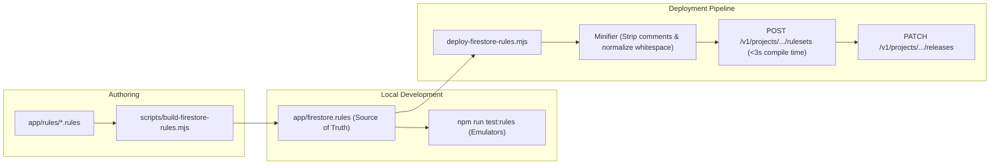

# Implementation Plan: Firestore Security Rules Modularization & Budget Refactoring

**Status**: `Ready`
**Blocked by**: None (PR #1009 provides immediate stability baseline)
**Unlocks**: Sustainable feature delivery for session execution, external plans, and multi-sport modules without AST exhaustion or 503 deployment timeouts
**Target Date**: 2026-10-09

---

## 1. Executive Summary & Problem Statement

At ~3,000 lines and ~191 KB, `app/firestore.rules` is operating near the limits of the Firebase Security Rules engine:

1. **Compilation Timeout (Gateway HTTP 503)**:
   - Google Cloud API Gateway enforces a strict 6.00-second timeout on `POST /v1/projects/{project}/rulesets`.
   - When comments and AST structures are parsed from cold cache, compilation takes 5.8s–6.2s, triggering deployment failures.
2. **Global AST Expression Budget (Release Update HTTP 400 & 409)**:
   - Firestore security rules compile into an AST evaluated against an undocumented global ruleset expression budget.
   - Recent features (PR #1003 execution resume, PR #998 external plan binding) pushed AST complexity over this limit, causing `PATCH /v1/projects/{project}/releases/cloud.firestore` to fail with `400 INVALID_ARGUMENT`, which `firebase-tools` then masked as `409 Requested entity already exists`.
3. **Developer Friction & Bloat**:
   - Monolithic single-file architecture with zero modularization.
   - Dual-role confusion: security rules are acting as an exhaustive JSON Schema validator for deep client payloads, duplicating TypeScript domain schemas across ~30 collections.

This plan delivers a two-tier solution:
- **Tier 1 (Infrastructure & Pipeline)**: Modular source structure (`app/rules/`) with a deterministic build assembler and pre-deploy minifier (stripping comments and redundant whitespace for deployment).
- **Tier 2 (Architectural Schema Pruning)**: Refocusing Firestore rules on security invariants (tenant isolation, immutability, state machines, exclusivity) and delegating deep payload schema validation to application-layer TypeScript/Zod schemas.

---

## 2. Invariants & Security Boundaries (Non-Negotiable)

Any refactoring must preserve 100% of the following guarantees:
1. **User Isolation (ADR-0002)**: Strict `isOwner(userId)` checks on every path. Direct cross-user reads and writes remain denied.
2. **Audit Immutability**: Historical records, frozen recommendation audits, and execution logs must enforce `allow update, delete: if false` (or exact one-way final state transitions).
3. **Exclusivity & Concurrency**: Window leases (`session_occurrence_windows`) and execution locks (`session_execution_locks`) must retain exact concurrency and anti-resurrection guarantees.
4. **State Machine Integrity**: Valid state transitions (`isValidOccurrenceStateTransition`, `isValidSessionExecutionUpdate`) must reject invalid state rollback or terminal overwrites.
5. **Emulator Test Suite Parity**: All 32 emulator test suites (391 tests in `app/src/emulator/`) must continue to pass without regression.

---

## 3. Architecture & Target State

### 3.1 Modular Source Directory Structure
Instead of editing a 3,000-line monolithic file, source rules will be authored in modular files under `app/rules/`:

```text
app/rules/
├── 00-header.rules                # Service definition, global helper functions (isOwner, isValidActivityDate)
├── 01-users-core.rules            # User profile, settings, athlete preferences
├── 02-schedule-windows.rules      # Schedule windows, manifests, and reservation leases
├── 03-external-plans.rules        # External plan headers, revisions, placements, and activations
├── 04-session-occurrences.rules   # Session occurrences, state transitions, window bindings
├── 05-session-executions.rules    # Session executions, entry diary, execution locks, prescriptions
├── 06-recommendations.rules       # Recommendations, intraday decisions, audits, and bundles
├── 07-health-anomalies.rules      # Health anomalies, subjective check-ins, assessment revisions
├── 08-outcomes-trials.rules       # Performance outcomes, assessment trials, derivations
├── 09-nutrition-anthropometry.rules # Nutrition days, body metrics, direct-write denials
└── 99-footer.rules                # Default deny rules, closing blocks
```

### 3.2 Build & Deployment Pipeline


---

## 4. Phased Implementation Steps

### Phase 1: Build Pipeline & Comment Stripping (Tooling Foundation)
**Goal**: Make rules deployment resilient to 503 timeouts and enable modular authoring without altering any security logic.

1. **Implement `app/scripts/minify-firestore-rules.mjs`**:
   - Provide `minifyRules(source: string): string` utility that:
     - Strips single-line comments (`// ...`) outside strings.
     - Preserves necessary newlines and structural tokens.
     - Trims excess indentation and blank lines.
   - Unit test the minifier to verify AST semantic equivalence.

2. **Update `app/scripts/deploy-firestore-rules.mjs` & `check-firestore-rules-drift.mjs`**:
   - When preparing rules for `firebase deploy` / API upload, pass the minified content.
   - For drift checking (`compareLocalFirestoreRules`), normalize both local and deployed source through the same minifier so comments in local files do not cause false drift.
   - Verify deployment compiles in < 3.2 seconds.

3. **Implement Modular Source Assembly (`app/scripts/build-firestore-rules.mjs`)**:
   - Extract domain chunks from `app/firestore.rules` into `app/rules/*.rules`.
   - Script concatenates modules in order and generates `app/firestore.rules`.
   - Add verification check in CI: `npm run rules:check-sync` ensuring `app/firestore.rules` matches `npm run rules:build`.

---

### Phase 2: Schema Pruning & AST Headroom Reclamation (Architectural Refactor)
**Goal**: Reclaim 30–45% of the ruleset AST budget by eliminating redundant schema assertions and combinatorics.

1. **Prune Redundant `hasAll` Clauses**:
   - Where a function asserts `data.keys().hasOnly(['a', 'b'])` followed immediately by `data.a is string && data.b is int`, the additional `data.keys().hasAll(['a', 'b'])` check is completely redundant AST overhead.
   - Target functions:
     - `hasValidSessionSource` (catalog, external_plan, manual, unplanned_fixture)
     - `hasValidExternalPlanPlacement`
     - `hasValidOccurrenceWindowBinding`
     - `hasValidSessionOccurrence` (definitionRef, externalPlanRef)
   - *Estimated AST budget reclaimed: ~80–120 nodes.*

2. **Streamline Deep Nested Payload Validation**:
   - Firestore rules should validate the container document and top-level identity keys, leaving deep multi-level sub-map validation to TypeScript/Zod client parsers:
     - `execution_prescriptions`: Validate `schemaVersion`, `userId`, `prescriptionHash`, `definitionHash`, `blocks is list`. Prune deep field-by-field verification of `definitionSnapshot` (e.g. `movementComposition`, `dominantModality`, `sessionTargets`).
     - `hasValidIntradayBundlePlacementAudit`: Validate audit identity, `planSnapshot.planId`, `revision`, `schemaVersion`. Prune detailed assertions on internal `planSnapshot.sessions` and `intentBlocks` structures.
     - `session_executions.entries`: Keep entry identity, state, and timestamp guards; delegate granular exercise parameter payload checks to app validators.
   - *Estimated AST budget reclaimed: ~150–200 nodes.*

3. **Simplify Pairwise Combinatorics**:
   - Replace manual unrolled pairwise comparisons in array bounds with capped iterative helpers or bounded cardinality limits.

---

### Phase 3: Comprehensive Verification & Gate Alignment

1. **Local Security Rules Emulator Gate**:
   - Run full 32-file suite: `npm run test:rules`.
   - Verify 391/391 tests pass without modification to test expectations.
2. **Compiler Latency & AST Benchmarking**:
   - Benchmark live GCP compilation duration:
     - Baseline (pre-refactor): ~6.1s (timeouts).
     - Target (post-refactor): **<= 2.5s** (safe margin under the 6s threshold).
   - Run `firebase deploy --only firestore:rules --dry-run` to ensure zero compilation warnings.
3. **Frontend Full Suite Validation**:
   - Run `npm run check` (`tsc -b`, `eslint`, `vitest` 8,179 tests, latency performance tests, knowledge validation, workouts validation).
4. **CI & Drift Verification**:
   - Run `npm run firestore:rules:drift -- --project adaptive-training-recommender`.
   - Verify `Deploy Production E2E` workflow deploys cleanly on attempt 1 without retries.

---

## 5. Risk Assessment & Mitigation

| Risk | Impact | Mitigation Strategy |
|---|---|---|
| **Accidental Security Leak during Schema Pruning** | High | Every collection maintains strict `isOwner(userId)` and immutability checks (`allow update, delete: if false`). Pruning targets only non-security payload subfields. |
| **Emulator Test Failure on Strict Checks** | Medium | The existing 32 emulator test suites specifically test rejection of bad inputs. Any pruned check that breaks an emulator expectation will be preserved or adjusted in consultation with test invariants. |
| **Drift Mismatch during Deployment** | Medium | Normalize both local and deployed comparisons using AST/token normalization in `check-firestore-rules-drift.mjs`. |
| **Build Script Desynchronization** | Low | Add CI static check `git diff --exit-code app/firestore.rules` after running `npm run rules:build`. |

---

## 6. Success Criteria

- [ ] `app/firestore.rules` is modularized into cleanly separated files under `app/rules/`.
- [ ] Automated build and minification pipeline integrated into `deploy-firestore-rules.mjs`.
- [ ] GCP cold compilation latency reduced from >6.0s to **<3.0s**.
- [ ] Compiler dry-run produces **0 warnings and 0 errors**.
- [ ] All 32 emulator test files (391 tests) pass with zero failures.
- [ ] Production rules deploy succeeds cleanly on Attempt 1/3 in CI/CD.
